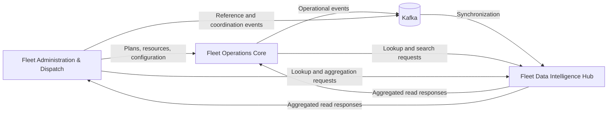

# Three Connected Fleet Projects — Design Specification

**Date:** 2026-07-29  
**Status:** Approved  
**Portfolio owner:** Nguyen Thanh Tam

## Purpose

Replace the two existing featured case studies with three NDA-safe case studies that represent connected backend services within one fictionalized logistics fleet-operations platform.

The public presentation must preserve only evidence-backed service responsibilities and integration styles. It must not expose private repository names, source paths, customers, organizations, business identifiers, internal modules, endpoints, event topics, schemas, infrastructure addresses, credentials, or deployment topology.

## Approved Direction

Use a service-centric presentation. Each featured project is a standalone case-study page, while the homepage and every detail page make it clear that all three services belong to the same platform.

The three public projects are:

1. **Fleet Operations Core** — operational workflows, interactive lookup, statistics, and document generation.
2. **Fleet Administration & Dispatch** — planning, resources, devices, configuration, and operational coordination.
3. **Fleet Data Intelligence Hub** — multi-source synchronization, aggregation, search, and read-oriented data access.

No quantitative contribution or performance claims will be published.

## Platform Relationship

The homepage introduces the three case studies with a generalized ecosystem diagram:

This diagram is a public conceptual view, not the private production topology. It communicates only the approved relationships:

- Administration and Dispatch supplies planning, resource, and configuration context to operational workflows.
- Operations Core executes interactive workflows and publishes relevant operational events.
- Data Intelligence Hub consumes synchronization events and provides search-oriented or aggregated reads.
- Administration and Dispatch can also request aggregated data needed by supported coordination views.
- REST/gRPC represent synchronous service communication; Kafka represents asynchronous synchronization boundaries.

## Homepage Information Architecture

Add a **Fleet Operations Platform** introduction immediately before the featured-project cards. It contains:

- a short statement that the case studies represent services in one platform;
- the generalized ecosystem diagram;
- an NDA note explaining that names and boundaries have been anonymized.

Render three featured cards in a three-column grid on large screens and a single-column layout on small screens. Card labels are:

- `Service 01 / Operational Core`
- `Service 02 / Administration`
- `Service 03 / Data Intelligence`

Each card retains the existing **Read Case Study** and **Preview Architecture** actions.

## Shared Case-Study Form

All three detail pages use the same established sections:

1. Overview
2. Requirements
3. Key Challenges
4. Architecture Diagram
5. Main Flow
6. My Contributions
7. Tech Stack
8. Reliability & Security
9. Trade-offs / Design Decisions
10. Outcome / Impact
11. Lessons Learned

Each page identifies the project as a service within the Fleet Operations Platform. Its architecture diagram shows all three services, highlights the current service, and expands only its generalized internal responsibilities.

Add **Related Platform Services** at the bottom of each case study, linking to the other two project pages.

## Project Content Boundaries

### 1. Fleet Operations Core

**Public responsibility**

- Receive and validate operational requests through REST or gRPC interfaces.
- Orchestrate operational workflows, lookup, statistics, and document-generation use cases.
- Use planning and configuration context supplied by the administration service.
- Publish selected operational events and use the data service for aggregated lookup and search.

**Main-flow narrative**

1. An operations client submits a request.
2. The API boundary validates and maps it to a use case.
3. The use case applies workflow and state rules.
4. The service reads or writes relational data and uses cache state where appropriate.
5. It calls a related service for planning context or aggregated data when required.
6. It returns a normalized response, generates an approved document, or publishes an event.

**My Contributions wording**

Describe REST API development, business-rule handling, database queries, Redis usage, REST/gRPC integrations, Kafka integration, and document-generation work. Do not attach counts or claim ownership of the whole service.

### 2. Fleet Administration & Dispatch

**Public responsibility**

- Manage planning, resources, devices, configuration, and operational reference data.
- Validate lifecycle and assignment state for supported administration workflows.
- Provide administration context to Operations Core through REST/gRPC boundaries.
- Publish selected changes for asynchronous synchronization.

**Main-flow narrative**

1. An administrator submits a planning, resource, device, or configuration request.
2. The API boundary validates the request and authorization context.
3. The use case applies state, assignment, and consistency rules.
4. The service persists the approved change and updates explicit cache state where relevant.
5. It exposes updated context synchronously or publishes a change event.
6. Operations Core and Data Intelligence Hub consume the appropriate result through their respective boundaries.

**My Contributions wording**

Describe administration APIs, validation, relational queries, Redis cache or coordination patterns, event integration, service-to-service communication, and supported reports. Do not publish counts or unverified ownership claims.

### 3. Fleet Data Intelligence Hub

**Public responsibility**

- Receive data from asynchronous events and approved service integrations.
- Normalize and synchronize records from multiple sources.
- Build read-oriented data for aggregation and operational search.
- Provide REST/gRPC lookup responses to other platform services.
- Track integration and resynchronization state at a generalized level.

**Main-flow narrative**

1. Kafka consumers or integration adapters receive source changes.
2. Synchronization workers validate, map, and normalize the records.
3. The service persists operational read data and updates search projections.
4. REST/gRPC interfaces accept lookup or aggregation requests.
5. Query services select relational, document-oriented, or search-backed access according to the request.
6. A normalized result is returned to Operations Core or Administration and Dispatch.

**My Contributions wording**

Describe synchronization workers, lookup APIs, query handling, Elasticsearch integration, data processing, Kafka consumers, and REST/gRPC integration. Do not publish source-specific entity names or volume claims.

## Approved Public Technology Mapping

| Project | Public technologies |
| --- | --- |
| Fleet Operations Core | Java 17, Spring Boot, REST, gRPC, Kafka, Redis, Elasticsearch, relational database, OpenFeign, PDF/document generation, Docker |
| Fleet Administration & Dispatch | Java 17, Spring Boot, REST, gRPC, Kafka, Redis, Elasticsearch, relational database, ShedLock, Docker |
| Fleet Data Intelligence Hub | Java 17, Spring Boot, REST, gRPC, Kafka, Elasticsearch, MongoDB, relational database, OpenFeign, Docker |

Technology lists describe evidenced integration boundaries. They must not imply sole ownership, universal use across every flow, or a specific production deployment.

## Reliability and Design-Decision Themes

Use only qualitative, defensible themes:

- clear separation between API, use-case, persistence, integration, event, cache, and search boundaries;
- explicit validation of workflow state and ownership before supported writes;
- asynchronous synchronization with acknowledged eventual consistency;
- Redis used for explicit cache or coordination responsibilities, not presented as the relational source of truth;
- search indexes treated as read-oriented projections rather than undisclosed sources of truth;
- bounded retry, locking, or fallback descriptions only where relevant;
- sensitive data and production details omitted from public artifacts.

Outcomes remain qualitative: clearer service responsibilities, consistent access to operational data, and reduced direct coupling through explicit synchronous and asynchronous boundaries.

## Confidentiality Guardrails

Public source and generated artifacts must not contain:

- private repository names or filesystem paths;
- customer, organization, or product identifiers;
- private class, package, module, method, endpoint, topic, table, index, or collection names;
- credentials, environment values, network addresses, or deployment topology;
- domain-specific records that can identify the original system;
- API counts, data volumes, user counts, latency, throughput, availability, or other unverified metrics;
- claims that the portfolio owner designed or owned an entire service unless separately confirmed.

All names, diagrams, and descriptions are fictionalized and generalized while preserving the verified service roles and integration patterns.

## Acceptance Criteria

- The homepage presents exactly three featured case studies.
- The shared platform relationship is visible before the three cards.
- Each project has a unique route, architecture preview, and full case-study page.
- Each detail diagram shows how its service relates to the other two.
- Every detail page links to the other platform services.
- Existing responsive, accessible, SEO, prerender, sitemap, and GitHub Pages behavior remains valid.
- Automated tests expect three approved routes and reject legacy or private identifiers.
- Production build, lint, tests, and confidentiality checks pass.

## Explicit Non-Goals

- Reproducing the private system's exact architecture or business domain.
- Publishing source-derived names, metrics, schemas, or infrastructure details.
- Adding claims about team size, duration, performance, availability, or business impact without user confirmation.
- Changing unrelated profile, experience, education, certificate, contact, or CV content.
